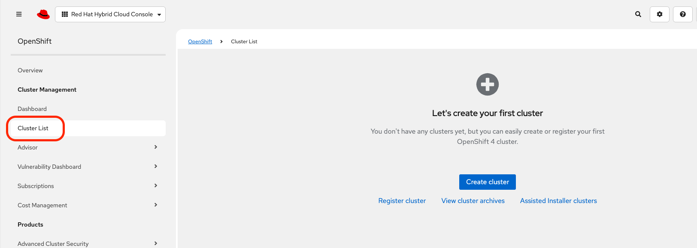
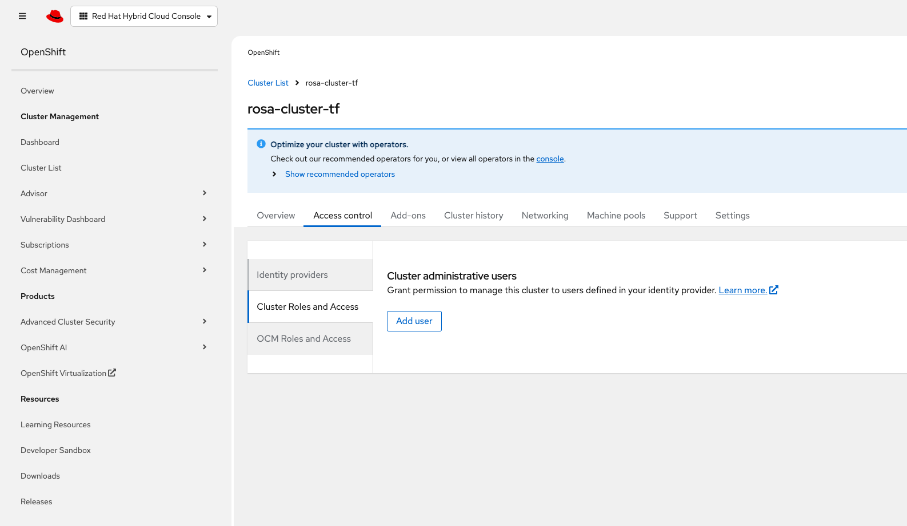
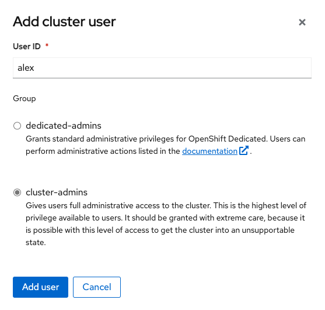
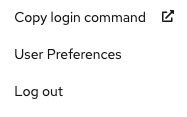
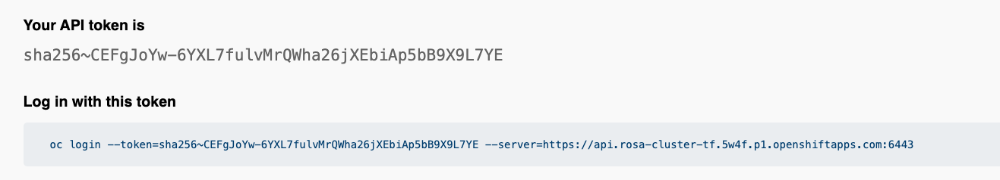

# Terraform Deployment for ROSA and Veeam Kasten Operator

This repository contains Terraform code to deploy a Red Hat OpenShift Service on AWS (ROSA) cluster and the Veeam Kasten K10 operator for data protection and management.

## Prerequisites

- AWS CLI installed and configured with appropriate credentials
- Terraform (version 1.0.0 or higher)
- OpenShift CLI (`oc`) installed
- Red Hat OpenShift Cluster Manager token

To provision a ROSA cluster through the rhcs Terraform provider, an **offline token access** needs to be created by using the Red Hat Hybrid Cloud Console.

```url
https://console.redhat.com/openshift/token/rosa
```

- Optional: Azure CLI (if using Azure for the backend state) - Reminder the Terraform state file 

_Reminder_ the Terraform backend (`backend.tf`) file is mandatory for every environment that needs to be managed by Terraform. For security reasons, it is strongly recommended to store the the `tfstate` file on a remote secure place, like for instance in an Azure Storage Account instead of keeping this file on the local machine of the Kasten SE. The `tfstate` file contains all the information that the 'terraform apply' will execute during the deployment process, like credentials and all the sensitive information used by Terraform. It's the fully detailed plan applied by Terraform. That's the reason why it needs to be stored in a secured place. The other reason for storing remotely the `tfstate` file, is to allow to collaboration between different contributors on the same project. As soon as someone as access to the `tfstate` file, that person can retrieve all the details of the deployment and even execute on behalf of someone else a terraform destroy command and delete a complete environment.

### Terraform State Storage Options (For reference)

The following table compares different options for storing your Terraform state files:

| Storage Option | Pros | Cons |
|----------------|------|------|
| **Local File System** | • Simple setup with no additional configuration<br>• No external dependencies<br>• Fast access | • Not suitable for team collaboration<br>• No versioning<br>• Risk of data loss<br>• Security concerns (sensitive data on local machine) |
| **AWS S3** | • Built-in versioning<br>• Encryption at rest<br>• Locking via DynamoDB<br>• High availability<br>• Cost-effective | • Requires AWS account and credentials<br>• Additional setup required<br>• Network dependency |
| **Azure Blob Storage** | • Built-in versioning<br>• Encryption at rest<br>• Locking capabilities<br>• High availability | • Requires Azure account and credentials<br>• Additional setup required<br>• Network dependency |
| **Google Cloud Storage** | • Built-in versioning<br>• Encryption at rest<br>• Locking capabilities<br>• High availability | • Requires GCP account and credentials<br>• Additional setup required<br>• Network dependency |
| **HashiCorp Terraform Cloud** | • Built-in state management<br>• Remote operations<br>• Team collaboration features<br>• Access controls<br>• CI/CD integration | • Costs for teams/enterprise features<br>• External service dependency<br>• Network dependency |
| **GitLab CI/CD** | • Integrated with GitLab repositories<br>• Access controls<br>• CI/CD integration | • Potential performance issues<br>• Setup complexity<br>• Not designed specifically for state storage |
| **Terraform Enterprise** | • Advanced team workflows<br>• Policy as code (Sentinel)<br>• Private network deployment options<br>• Enhanced security features<br>• Audit logging | • Significant cost<br>• Complex setup<br>• Enterprise focus may be overkill for small teams |

Exclude the `backend.tf` from your configuration if the `tfstate` will remain on the local workstation, or adapt the configuration depending on the terraform backend selected.


## Deployment Process

The deployment is divided into two stages:

1. Stage 1: Deploy the ROSA cluster
2. Stage 2: Deploy the Veeam Kasten K10 Operator and optional components

In this scenario, we consider that the Veeam Kasten Operator is going to be installed on OpenShift running in AWS. During the deployment of the Operator, there is an additional step seamlessly added which is the creation of an [`Infrastructure Profile`](https://docs.kasten.io/latest/install/storage.html#aws-infrastructure-profile) and some specific settings added on the configuration of the [AWS EBS `io2` storageclass](https://docs.aws.amazon.com/ebs/latest/userguide/ebs-volume-types.html).
The purpose of the Infrastructure profile is to allow Veeam Kasten to directly interact with AWS EBS APIs during the execution of the backup and export actions. In the particular case of AWS EBS, Veeam Kasten through the Infrastructure Profile can leverage AWS EBS APIs to support the `Change Block Tracking` mecanism, making the backup of large PVC more efficient. If you want to know more about `CBT` in Kubernetes [check this out](https://thenewstack.io/kubernetes-advances-cloud-native-data-protection-share-feedback/).

## Stage 1: Deploy ROSA Cluster

### Step 1: Configure Backend State (Optional)

If you're using Azure for backend state storage:

1. Edit the backend configuration in `stage_1_rosa/backend.tf`:

Adapt the configuration of the `backend.tf` file depending on your Terraform backend

2. Log in to Azure:

If the Terraform backend is stored in Azure Blob, then you need to initialise your access to your Azure subscription.

   ```bash
   az login
   ```

### Step 2: Configure Variables

1. Navigate to the stage_1_rosa directory:

   ```bash
   cd stage_1_rosa
   ```

2. Create or edit a `.tfvars` file in the `tfvars` directory. You can use the provided example as a template:

   ```bash
   cp tfvars/stage_1_rosa.tfvars tfvars/your-name.tfvars
   ```

3. Edit your `.tfvars` file with appropriate values:

   ```hcl
   aws_region      = "us-east-1"                 # Your AWS region
   tag_expire_by   = "2024-12-31"                # Expiration date for resources - change the date depending on your requirements
   tag_environment = "my-rosa-env-tf"            # Environment name (must end with -tf) - change the name depending on your requirements
   
   new_vpc_name    = "rosa-vpc-tf"               # Name for the new VPC (must end with -tf)
   
   cluster_name            = "my-rosa-cluster-tf" # ROSA cluster name (must end with -tf)
   openshift_version       = "4.17.19"            # OpenShift version
   compute_machine_type    = "m5.xlarge"          # AWS instance type
   token                   = "your-token"         # RHCS token
   htpasswd_idp_user       = "openshift-admin"    # Admin username
   htpasswd                = "secure-password"    # Admin password
   
   bucket_name = "my-rosa-bucket-tf"              # S3 bucket name (must end with -tf) - This bucket will be used by Veeam Kasten to export the Kasten backup in a secure location
   ```

⚠️ For the `compute_machine_type` you can select one of the instance available for a ROSa deployment by running the script `rosa_instances.sh` available in the `stage_1_rosa` folder. It lists all the eligable EC2 instances for ROSA. You need to install the `rosa` cli first before running this script. ⚠️

```text
ID                 CATEGORY              CPU_CORES  MEMORY
a1.2xlarge         accelerated_computing 8          16
a1.4xlarge         accelerated_computing 16         32
a1.large           accelerated_computing 2          4
a1.medium          storage_optimized     1          2
a1.metal           storage_optimized     16         32
a1.xlarge          accelerated_computing 4          8
c1.medium          compute_optimized     2          1.69921875
c1.xlarge          accelerated_computing 8          7
c3.2xlarge         accelerated_computing 8          15
....
```

### Step 3: Initialize and Apply Terraform

1. Initialize Terraform:

   ```bash
   terraform init
   ```

2. Validate your configuration:

   ```bash
   terraform validate
   ```

3. Plan the deployment:

   ```bash
   terraform plan -var-file=tfvars/your-name.tfvars
   ```

4. Apply the configuration:

   ```bash
   terraform apply -var-file=tfvars/your-name.tfvars
   ```

You can add the `-auto-approve` at the end of the `terraform apply` command to automatically approve the deployment of the ROSA cluster

5. Wait for the ROSA cluster to be deployed (this may take 40-50 minutes).

### Step 4: Verify the ROSA Cluster Deployment

1. Check the status of your ROSA cluster:

From the Red Hat Hybrid Cloud Console, you should see to ROSA cluster up and running



2. Configure the Access to connect to your ROSA cluster:

 From the Red Hat Hybrid Management Console , navigate to:

* `Cluster List`
* `<name of your rosa cluster>`
* `Access Control` tab
* In the `Identity Provider` tab there is already an htpasswd created.


Now, go to the `Cluster Roles and Access` tab, and create a user. Click on Add User



Refer to the `htpasswd_idp_user` in the `tfvars` file to define the `User ID`. Select `cluster-admins` for granting the full permissions to this account.



Wait a couple of minutes while the creation of the user is properly applied.

3. Verify the connection:

Once you are login, in order, to connect to the OCP cluster from your shell, click on right hand corner, on your `User ID` and then go on `Copy login command`.



Copy/paste in your terminal the `oc login --token` command, before moving on the deployment of Veeam Kasten.



Using the `oc` command line you can also verify your access to the ROSA cluster by running this command:

   ```bash
   oc get nodes
   ```

## Stage 2: Deploy Veeam Kasten K10 and Optional Components

### Step 1: Configure Backend State (Optional)

If you're using Azure for backend state storage, or any other remote storage backend,adapt the configuration of the `backend.tf` file to initialise the Terraform backend for the deployment of the Veeam Kasten Operator.

1. Edit the backend configuration in `stage_2_k10/backend.tf`:

   ```hcl
   terraform {
     backend "azurerm" {
       storage_account_name = "your-storage-account-name"
       container_name       = "your-container-name"
       key                  = "stage-2-k10.tfstate"
     }
   }
   ```

### Step 2: Configure Variables

1. Navigate to the stage_2_k10 directory:

   ```bash
   cd ../stage_2_k10
   ```

2. Create or edit a `.tfvars` file in the `tfvars` directory. You can use the provided example as a template:

   ```bash
   cp tfvars/stage_2_k10.tfvars tfvars/your-name.tfvars
   ```

3. Edit your `.tfvars` file with appropriate values:

   ```hcl
   tag_expire_by   = "2024-12-31" # change the date depending on your requirements
   tag_environment = "rosa-k10-tf" # change the name depending on your requirements
   
   kubeconfig_path = "~/.kube/config"
   token           = "your-rhcs-token"
   
   kasten_ocp_project_description  = "Kubernetes data management platform"
   kasten_ocp_project_display_name = "Kasten K10"
   kasten_namespace                = "kasten-io"
   channel                         = "stable"
   installPlanApproval             = "Automatic"
   kasten_operator_name            = "k10-kasten-operator-term-rhmp"
   source_catalog                  = "redhat-marketplace"
   sourceNamespace                 = "openshift-marketplace"
   startingCSV                     = "k10-kasten-operator-term-rhmp.v7.5.7" //change the version of the Kasten K10 operator if needed
   
   enable_openshift_virtualization    = false # Set to true to enable OpenShift Virtualization
   enable_advanced_cluster_management = false # Set to true to enable OpenShift ACM
   ```

### Step 3: Initialize and Apply Terraform

1. Make sure you're logged in to your ROSA cluster:

   ```bash
   oc login --token=<token> --server=<server-url>
   ```

2. Initialize Terraform:

   ```bash
   terraform init
   ```

3. Validate your configuration:

   ```bash
   terraform validate
   ```

4. Plan the deployment:

   ```bash
   terraform plan -var-file=tfvars/your-name.tfvars
   ```

5. Apply the configuration:

   ```bash
   terraform apply -var-file=tfvars/your-name.tfvars
   ```

6. Wait for the Veeam Kasten K10 operator to be deployed (this may take 5-10 minutes).

### Step 4: Verify the Veeam Kasten K10 Deployment

1. Check that all K10 pods are running:

   ```bash
   oc get pods -n kasten-io
   ```

2. Access the Veeam Kasten K10 dashboard:

Once the `terraform apply` is successfully completed, the `output.tf` configuration, shows directly in the terminal output the URL of the Veeam Kasten Management console

3. Log in to the dashboard using your OpenShift credentials.

By default the authentication to the Veeam Kasten Management console is configured with the OpenShift OAuth in this terraform deployment. The token requested during the login can be found by going into the `Copy login command` view and copy/paste the `API token` in the Veeam Kasten Management console.

```text
sha256~......
```

## Optional Components

### OpenShift Virtualization

**If you are interested to evaluate Veeam Kasten with OpenShift Virtualisation and understand how a Cloud Native VM can be protected, you can enable the installation of the OpenShift Virtualisation Operator by setting up the value at true. Otherwise by default the OCPV Operator won't be installed.**

If you enabled OpenShift Virtualization in your `.tfvars` file (`enable_openshift_virtualization = true`), verify its deployment:

```bash
oc get pods -n openshift-cnv
```

### Advanced Cluster Management (ACM)

If you enabled OpenShift Advanced Cluster Management in your `.tfvars` file (`enable_advanced_cluster_management = true`), verify its deployment:

```bash
oc get pods -n open-cluster-management
```

## Cleanup

### Step 1: Destroy Stage 2 Resources

1. Navigate to the stage_2_k10 directory:

   ```bash
   cd stage_2_k10
   ```

2. Destroy the resources:

   ```bash
   terraform destroy -var-file=tfvars/your-name.tfvars
   ```

3. If resources are stuck in terminating state, use the cleanup scripts:

   ```bash
   bash kasten_ns_cleanup.sh
   bash acm_cleanup.sh # If ACM was enabled
   ```

### Step 2: Destroy Stage 1 Resources

1. Navigate to the stage_1_rosa directory:

   ```bash
   cd ../stage_1_rosa
   ```

2. Destroy the resources:

   ```bash
   terraform destroy -var-file=tfvars/your-name.tfvars
   ```
